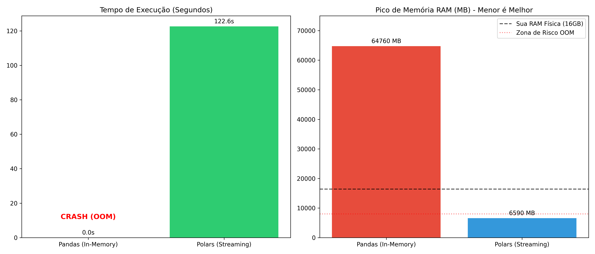

# 🚀 Motor de Ingestão Out-of-Core: Dados da Receita Federal

Um pipeline de engenharia de dados focado em **otimização extrema e eficiência de I/O**, construído para processar a carga massiva de Estabelecimentos da Receita Federal do Brasil (RFB) utilizando **Polars** em modo Streaming.

## 📌 O Problema (Gargalo Tradicional)
Os datasets da RFB ultrapassam **15 GB de dados brutos**. Abordagens tradicionais baseadas em memória (Eager) como `pandas.read_csv()` falham sistematicamente por:
1. **OOM (Out of Memory):** Tentativa de alocação total na RAM, resultando em crash do sistema.
2. **I/O Bound Severo:** Parsing ineficiente de strings gigantes em hardware legado.
3. **Escalabilidade Nula:** Impossibilidade de processar volumes maiores que a capacidade física da memória.

## ⚙️ A Solução: Arquitetura e Decisões Técnicas

Este projeto utiliza uma arquitetura **Out-of-Core** construída em Rust via Polars, focada em resiliência e aproveitamento máximo de hardware antigo.

* **Lazy API & Predicate Pushdown:** O plano de execução é otimizado e os filtros são aplicados antes de qualquer leitura física, reduzindo drasticamente o overhead.
* **Streaming Engine:** Utilização do método `.sink_parquet()` para processamento em lotes (*chunks*), mantendo a estabilidade do sistema sob carga pesada.
* **Resiliência de Hardware:** Detecção automática de conjunto de instruções e fallback para modo de compatibilidade (RT-Compat), permitindo execução em CPUs sem suporte a AVX2.
* **Storage Layer (Parquet + Zstd):** Compactação agressiva e tipagem rigorosa, reduzindo 16 GB de dados brutos para ~3.8 GB em formato colunar otimizado.

## 📊 Benchmarks de Performance (Carga Real: 16.19 GB)

O teste de estresse foi realizado processando o dataset completo de Estabelecimentos da Receita Federal.

| Métrica | Pandas (In-Memory) | Polars (Streaming/Out-of-Core) |
| :--- | :--- | :--- |
| **Status** | ❌ CRASH (Out of Memory) | ✅ SUCESSO |
| **Tempo de Execução** | Falha Crítica | **~125.73 Segundos** |
| **Pico de RAM** | > 16 GB (Sistema Trava) | **6.56 GB (Estável)** |
| **Volume de Leitura** | - | **16,189.38 MB** |
| **Uso de CPU** | - | **261.8% (Multi-thread)** |

**Especificações do Ambiente de Teste:**
* **Processador:** Intel Core i5-3470 @ 3.20GHz (Ivy Bridge)
* **Memória:** 16GB RAM DDR3
* **OS:** Windows 11 Pro



## 🛠️ Como Executar

**Pré-requisitos:** Python 3.12+ e [Poetry](https://python-poetry.org/)

### 1. Instalar dependências

```bash
git clone <url-do-repositorio>
cd rfb-polars-etl
poetry install
```

Ou, com o Makefile:

```bash
make install
```

### 2. Preparar os dados brutos

Baixe os arquivos de **Estabelecimentos** no site de [Dados Abertos da RFB](https://www.gov.br/receitafederal/pt-br/assuntos/orientacao-tributaria/cadastros/consultas/dados-publicos-cnpj) e coloque-os em:

```
data/raw/
```

O pipeline aceita **ambos** os formatos de nome:

- `*.ESTABELE` (padrão oficial da RFB)
- `*.csv` (se você renomear ou exportar com essa extensão)

Exemplo de estrutura:

```
rfb-polars-etl/
├── data/
│   ├── raw/
│   │   ├── F.K03200$Z.D41213.ESTABELE
│   │   └── ...
│   └── silver/
│       └── estabelecimentos_consolidado.parquet   # gerado pelo pipeline
└── src/
```

### 3. Executar o pipeline principal

```bash
make run
```

Equivalente direto:

```bash
poetry run python -m rfb_polars_etl.main
```

Saída esperada: `data/silver/estabelecimentos_consolidado.parquet`

### 4. Consulta de municípios (opcional)

Após gerar o Parquet silver:

```bash
make query
```

Ou:

```bash
poetry run python -m rfb_polars_etl.query_municipios
```

Gera `empresas_municipios_selecionados.xlsx` no diretório atual.

### 5. Testes e benchmark

```bash
make test        # pytest (não exige dados reais)
make benchmark   # requer arquivos em data/raw/
make clean       # remove parquet silver e gráficos de benchmark
```

### Comandos Makefile

| Comando | Descrição |
| :--- | :--- |
| `make help` | Lista todos os comandos |
| `make install` | `poetry install` |
| `make run` | Pipeline ETL principal |
| `make query` | Consulta filtrada por municípios |
| `make test` | Testes unitários |
| `make benchmark` | Auditoria de performance |
| `make clean` | Limpa outputs gerados |

### Alternativa sem Poetry

```bash
python3 -m venv .venv
source .venv/bin/activate
pip install "polars[rtcompat]>=1.39" pyarrow xlsxwriter pytest
pip install -e .
PYTHONPATH=src python -m rfb_polars_etl.main
```